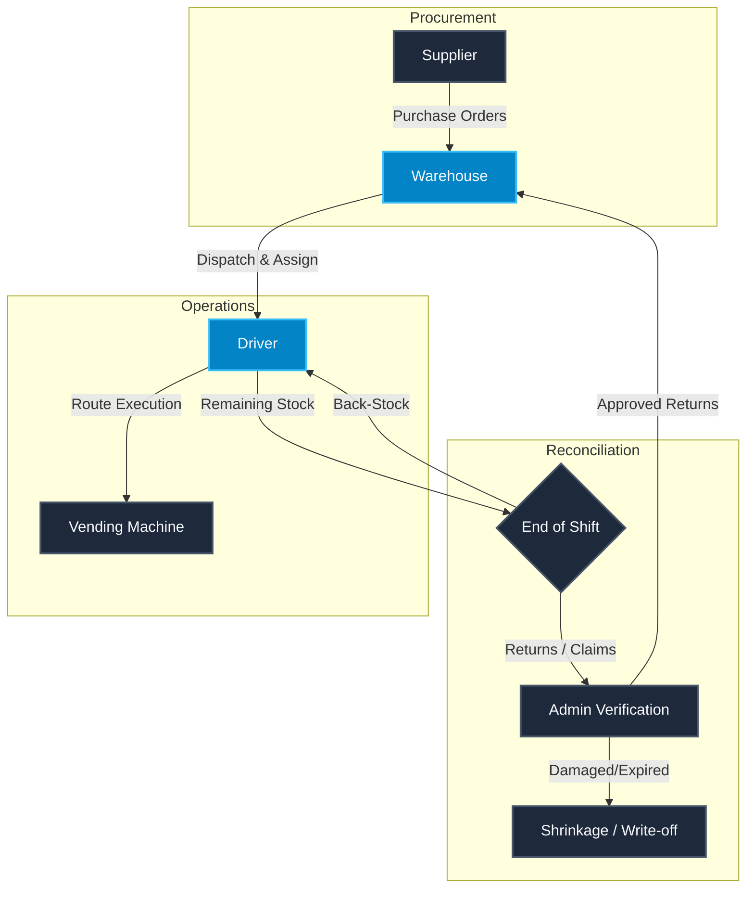

# 🚀 NexGen Vending Management System (AII)

[Link to Live Demo](https://your-demo-link.com)

## 📖 Overview

The **NexGen Vending Management System** (Adaptive Inventory Intelligence) is a sophisticated, real-time full-stack enterprise application designed to manage the end-to-end logistics and inventory ecosystem of a regional vending machine network. Originally developed for a Saudi vending operation, the system provides a comprehensive workflow covering procurement, dispatch, route tracking, and automated inventory reconciliation.

As a recent graduate specializing in **Artificial Intelligence & Machine Learning**, I engineered the system's architecture to be "AI-ready." The data models and transactional logs are structured to eventually ingest complex operational data for machine learning applications, such as demand forecasting, anomaly detection in inventory shrinkage, and dynamic route optimization.

## 🚀 Key Features

- **Centralized Inventory Ledger**: Real-time tracking of item flow using Weighted Average Cost (WAC) methodology to ensure precise financial reporting and Cost of Goods Sold (COGS) calculations.
- **Role-Based Access Control (RBAC)**: Secure multi-tenant portals tailored for Administrators and Drivers, utilizing NextAuth.js and custom middleware guards.
- **Live Dispatch Synchronization**: Supabase Realtime WebSocket push delivers ~50ms cross-tab updates between drivers in the field and the warehouse, with zero idle background traffic.
- **Automated Return & Claim Verification**: Intelligent workflows to process back-stock, damaged, or expired items, with automatic financial deduction and shrinkage tracking.
- **Neo-Glassmorphism UI**: A highly polished, responsive interface utilizing modern CSS design tokens, dynamic container queries, and fluid animations.

## 🛠️ Tech Stack & Architecture

### Frameworks & Languages

- **Next.js 16 (App Router)**: Core framework for server-rendered React applications, utilizing modern streaming and suspense boundaries.
- **TypeScript**: Strict static typing across the entire stack for type-safe data serialization and reduction of runtime errors.
- **Tailwind CSS & Framer Motion**: Utility-first styling combined with declarative micro-animations for a premium user experience.

### Backend & Databases

- **Prisma ORM**: Type-safe database access layer for seamless schema migrations and relational queries.
- **PostgreSQL (Supabase)**: Production relational database handling complex inventory transactions and foreign-key constraints.
- **Upstash Redis**: In-memory data store utilized for aggressive rate-limiting to prevent brute-force attacks.

### APIs & Protocols

- **Next.js Server Actions (RPC/REST)**: Handlers for secure data mutations, bypassing traditional API routes for direct, typed server execution.
- **Supabase Realtime (WebSocket)**: Single shared subscription per page tree pushes change events to all connected admin clients; replaced an earlier SSE/polling design.
- **Geoapify API**: External geocoding and mapping integration for precise geographical data handling.
- **NextAuth.js v5**: Authentication flow managing secure session tokens and role-based permissions, with separate credential branches for admins (email + bcrypt) and drivers (phone + PIN).

## 🔄 Logistics Flow Diagram

The following diagram illustrates the lifecycle of inventory as it moves through the system:



## 📋 Example Use Case: The Daily Dispatch Cycle

To understand how the system is used in production, consider the following daily workflow:

1. **Procurement (Admin)**: The warehouse receives 500 units of Coca-Cola. The Admin logs a Purchase Order. The system dynamically recalculates the WAC (Weighted Average Cost) to ensure accurate financial reporting.
2. **Dispatching (Admin)**: The Admin creates a route for "Driver Ali", allocating 100 units of Coca-Cola to his vehicle from the Dammam Warehouse.
3. **Route Execution (Driver)**: Ali opens his mobile dashboard (PWA, offline-first), views his bag, and arrives at "Machine A" to refill 20 units. The Admin dashboard updates instantly via Supabase Realtime push — no manual refresh.
4. **Reconciliation (Admin & Driver)**: At the end of the shift, Ali returns 80 units — 78 as back-stock and 2 as damaged via the per-line `DriverReturnSheet`. The Admin verifies the return; damaged units are deducted as shrinkage on the WAC ledger and the shift closes.

## ⚙️ Local Development

### Prerequisites

- Node.js (v18+)
- npm or yarn

### Installation

1. Clone the repository:
   ```bash
   git clone https://github.com/your-username/vending-manager.git
   ```
2. Install dependencies:
   ```bash
   npm install
   ```
3. Set up environment variables:
   Copy `.env.example` to `.env` and configure your Postgres (Supabase) URL, NextAuth secret, Upstash Redis, Vercel Blob, and the public Supabase URL/anon key used for Realtime.
4. Run database migrations:
   ```bash
   npx prisma migrate dev
   ```
   Then enable the `supabase_realtime` publication on the `SystemMeta` table in the Supabase dashboard so live updates work.
5. Start the development server:
   ```bash
   npm run dev
   ```

## 🧠 Technical Learnings & Challenges Overcome

- **Concurrency & Data Integrity**: Implemented strict auditing footprints (`InventoryAdjustment` and `RefillLogs`) to prevent race conditions when multiple drivers interact with the same warehouse concurrently.
- **Financial Accuracy**: Engineered a robust Weighted Average Cost (WAC) algorithm to dynamically calculate the COGS as purchase orders with fluctuating prices are checked in.
- **Real-time UX**: Iterated from polling → Upstash Redis pings → Supabase Realtime WebSocket push. The final design carries zero idle traffic and ~50ms latency, with a single subscription mounted at the layout level so per-page components can't accidentally open duplicate sockets.
- **Dispatchless Driver Stock**: Migrated the driver allocation surface from Dispatch/Route wrappers to direct `DriverStock` mutations behind a `USE_DISPATCHLESS` feature flag, with an ack/dispute workflow (`StockAssignment.PENDING_ACK → ACKNOWLEDGED | DISPUTED`) so drivers aren't blocked at issue time.
- **Security Hardening**: Conducted security audits to implement Upstash Redis rate-limiting on sensitive endpoints and scrubbed git history of exposed secrets.

---

_Developed by Asad — BS Computer Science (AI & ML Specialization)_
