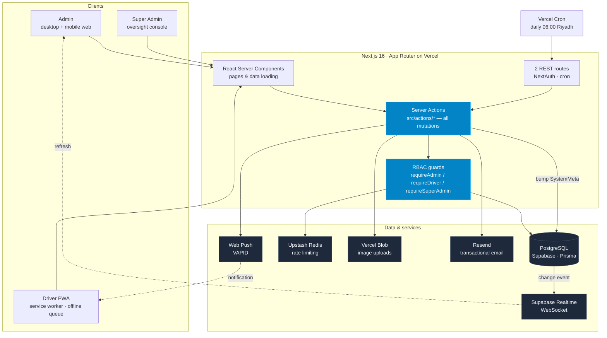
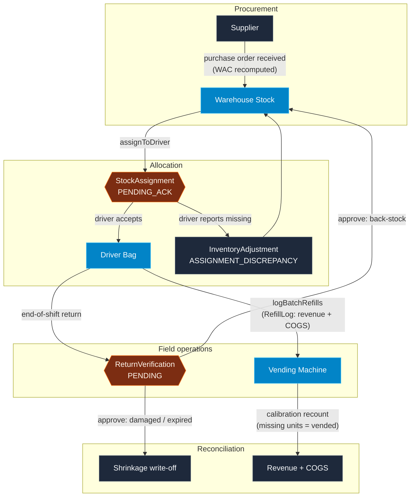

# NexGen Vending Management System

A full-stack operations platform for a regional vending network — procurement, warehouse stock, driver logistics, machine refills, and financial reporting in one system.

<p>
  
  
  
  
  
  
</p>

---

## Overview

The system tracks a single unit of stock from the moment a supplier delivers it to the moment it is sold out of a machine — and keeps the money attached to it correct at every hop.

Three things make that hard, and shape most of the design:

1. **Stock exists in three places at once** — the warehouse, a driver's bag, and inside a machine. Every movement has to leave an audit trail, because a missing case of drinks has to be explainable weeks later.
2. **Cost changes with every purchase.** The system uses **Weighted Average Cost (WAC)**, recomputed on each purchase order, and *snapshots* the cost and price onto every refill record. Financial history never shifts when today's prices do.
3. **Drivers are on phones, in the field, on bad connections.** The driver portal is an installable PWA with an offline queue and push notifications; the admin dashboard updates live over WebSockets.

It is in daily production use by a vending operation in Saudi Arabia.

## Who uses it

| Role | Works from | What they do |
| --- | --- | --- |
| **Admin** | Desktop + phone | Receive purchase orders, assign stock to drivers, verify returns, review financials and history |
| **Driver** | Phone only (PWA) | Accept or dispute assigned stock, refill machines, return leftovers/damages at end of shift |
| **Super Admin** | Desktop | Oversight console — audit trail, data-integrity alerts, system health, admin accounts |

## Features

### Inventory & finance
- **Weighted Average Cost ledger.** WAC recomputes on receipt across warehouse + machine + driver holdings. Supplier shortages accumulate as a `pending_deficit` rather than pushing inventory negative.
- **Purchase order receiving** with a live receipt summary (line count, units, subtotal, 15% VAT, grand total) so the receiver can match the paper tax invoice before confirming.
- **Three price tiers** per item — standard, hospital, hotel — selected by the machine's tier at refill time.
- **P&L and analytics** built from refill snapshots, never from live prices.
- **Stock calibration & cost correction** — recount warehouse or machine stock to a physical count without inventing fake purchase orders. A machine shortage books as a sale; a warehouse shortage is neutral. Both write an adjustment row and an audit entry.

### Driver logistics
- **Assign → acknowledge → dispute** flow. A driver confirms what actually landed in their bag; a discrepancy is recorded and the stock reverts to the warehouse immediately, so nobody is blocked at handover.
- **Dispatch templates** — reusable stock presets that pre-fill a driver's load, clamped to what the selected warehouse actually holds.
- **Offline-first refills.** Submissions queue in IndexedDB and replay when the connection returns. Each batch carries a client request ID, so a commit with a lost response is never double-counted.
- **Return verification.** End-of-shift returns are split per line into back-stock, damaged, or expired; an admin approves them, and write-offs land as shrinkage on the ledger.

### Platform
- **Live updates.** A single Supabase Realtime subscription at the root layout refreshes open dashboards when data changes — no polling, no idle traffic.
- **Push notifications (Web Push/VAPID)** for the three things that can't wait for someone to open the app: stock assigned to a driver, a disputed delivery, and a machine about to run dry.
- **Scheduled stock alerts.** A nightly cron predicts which machines will empty before their next scheduled visit and sends one digest to admins, de-duplicated so the same warning doesn't fire every morning for a week.
- **Audit trail everywhere.** Inventory mutations write `RefillLog` / `InventoryAdjustment`; admin state changes write `SystemAuditLog`, reviewable in the super-admin console.
- **Self-service password reset** for admins — hashed, single-use, 30-minute tokens, rate limited, and written so the response never reveals whether an email is registered.
- **AI Lab** (experimental, feature-flagged): a per-machine stockout forecast and a "silent failure" watch that flags demand collapse, demand spikes, overdue service, and abnormal damage rates — pure statistics against each machine's own baseline, advisory only.

## Architecture

Next.js App Router with **Server Actions as the entire backend**. There are exactly two REST routes: NextAuth, and the cron endpoint (a scheduler can only send an HTTP request, not invoke a server action).



**Three rules hold this together:**

1. **Every server action starts with an RBAC guard.** Middleware protects *pages*, not actions — every exported server action is a publicly callable endpoint, so the guard is the only authorization layer.
2. **Multi-item writes are set-based, inside one transaction.** Bulk operations use `UPDATE … FROM (VALUES …)` and batched inserts rather than per-item loops, which keeps a 40-line purchase order to a constant handful of statements.
3. **Financial history is immutable.** Refill logs snapshot the price and cost at write time. Corrections are posted as new adjustment rows; the ledger is never edited in place.

## Inventory lifecycle



### A day in the system

1. **Receive** — 500 units of Coca-Cola arrive. An admin logs the purchase order against the paper invoice; WAC recomputes across all stock on hand.
2. **Assign** — 100 units are pushed to Driver Ali's bag from the Dammam warehouse. His phone gets a push notification.
3. **Acknowledge** — Ali opens the app, counts 98, and disputes the line. The two missing units are recorded as a discrepancy and returned to warehouse stock.
4. **Refill** — At each machine he logs what went in. Revenue and COGS are booked from the snapshot prices; the admin dashboard updates live.
5. **Return** — At end of shift he returns 78 units as back-stock and 2 as damaged. An admin verifies: back-stock re-enters the warehouse, damages are written off as shrinkage.

## Tech stack

| Layer | Choice | Notes |
| --- | --- | --- |
| Framework | Next.js 16 (App Router), React 19 | Server Components + Server Actions |
| Language | TypeScript (strict) | Shared types derive from Prisma payloads |
| Database | PostgreSQL via Supabase, Prisma ORM | Schema managed with `db push` (no migrations folder) |
| Auth | NextAuth v5 | Admins: email + bcrypt. Drivers: phone + 4-digit PIN |
| Realtime | Supabase Realtime (WebSocket) | One shared subscription at the root layout |
| Push | Web Push (VAPID) + Serwist service worker | Installable PWA |
| Rate limiting | Upstash Redis | Login, PIN change, password reset |
| Styling | Tailwind CSS v4, Framer Motion | Neo-Design: glassmorphism, dark-mode first |
| Charts / maps | Recharts, Leaflet + Geoapify | Analytics dashboards and machine locations |
| Client state | Zustand + `idb-keyval` | Driver bag and offline refill queue |
| Storage / email | Vercel Blob, Resend | Item images, password-reset mail |
| Testing | Vitest + Testing Library | 28 test files, no database required |

## Getting started

### Prerequisites

- Node.js 20.9+
- A PostgreSQL database (Supabase recommended — Realtime and storage come with it)

### Setup

```bash
git clone https://github.com/anaCS-26/Vending-Manager.git
cd Vending-Manager
npm install
```

Create a `.env` file (see the table below), then push the schema and generate the client:

```bash
npx prisma db push
npx prisma generate
npm run db:seed:dev     # optional demo data
npm run dev
```

> **One-time Supabase step for live updates:** add the `SystemMeta` table to the `supabase_realtime` publication and grant the `anon` role `SELECT` on it. Without the grant the WebSocket connects but no events ever arrive — a silent failure.

### Environment variables

| Variable | Required | Purpose |
| --- | --- | --- |
| `DATABASE_URL`, `DIRECT_URL` | ✅ | Pooled and direct Postgres connections |
| `AUTH_SECRET` | ✅ | NextAuth session signing |
| `NEXT_PUBLIC_SUPABASE_URL`, `NEXT_PUBLIC_SUPABASE_ANON_KEY` | ✅ | Realtime subscription (baked at build time) |
| `UPSTASH_REDIS_REST_URL`, `UPSTASH_REDIS_REST_TOKEN` | ✅ | Rate limiting |
| `INITIAL_ADMIN_EMAIL`, `INITIAL_ADMIN_PASSWORD` | ✅ | First admin created by the seed script |
| `NEXT_PUBLIC_GEOAPIFY_API_KEY` | – | Address autocomplete for machine locations |
| `VAPID_PUBLIC_KEY`, `VAPID_PRIVATE_KEY`, `VAPID_SUBJECT` | – | Push notifications (`npx web-push generate-vapid-keys`) |
| `CRON_SECRET` | – | Bearer token for the stock-alert cron; the route refuses to run without it |
| `RESEND_API_KEY`, `RESEND_FROM` | – | Password-reset email; without it, links are logged to the console in dev |
| `BLOB_READ_WRITE_TOKEN` | – | Item image uploads |
| `NEXT_PUBLIC_ENABLE_AI_LAB` | – | Reveals the experimental `/super/lab` console |

Optional variables degrade gracefully — the feature reports itself as unconfigured rather than failing.

> **Note:** the service worker is disabled in development, so push notifications can only be tested against a production build (`npm run build && npm start`).

## Testing & CI

```bash
npm run test              # watch mode
npm run test -- --run     # single pass
npm run test:coverage
```

Tests mock Prisma, NextAuth, Redis, and Blob, so no database or network is needed. Coverage focuses on the layers where a bug costs money: WAC math, server-action authorization, transaction shape, the offline queue, and the driver UI. See [TESTING.md](TESTING.md).

CI runs `tsc --noEmit`, ESLint, and the full Vitest suite on every push and pull request.

## Project structure

```
src/
├── actions/      Server actions by domain — the entire backend
├── app/          App Router: /admin, /driver, /super, auth pages, sw.ts
├── components/   Shared UI (Neo-Design primitives, modals, tables, charts)
├── lib/          Domain logic: WAC, P&L, forecasting, push, auth guards
├── hooks/        Client behaviour (modals, realtime, push, offline sync)
├── stores/       Zustand stores + IndexedDB persistence
└── types/        Shared Prisma-derived types
prisma/schema.prisma
tests/            Mirrors src/
scripts/          Seeding, resets, diagnostics
```

## Engineering notes

- **Realtime, the third attempt.** Polling was wasteful and Redis pings still needed a poll to read them. The final design writes a version row to Postgres and lets Supabase Realtime push the change over an existing WebSocket — no idle traffic, and one subscription mounted at the root so pages can't accidentally open a second socket.
- **Transactions vs. pooler latency.** In production every query crosses a connection pooler, so a loop of 8 queries per line item blew Prisma's 5-second interactive transaction window on a real supplier invoice. Concurrency doesn't help — a transaction pins one connection — so bulk writes were rewritten as constant-count set-based SQL. Regression tests assert the *number* of statements, not just the result.
- **Push has to be awaited.** Serverless functions freeze the moment a response is sent, so a fire-and-forget notification often never leaves. Sends fan out in parallel, cap at four seconds, and can never throw into the caller — a dead push service must not fail an assignment whose stock has already moved.
- **Dead subscriptions prune themselves.** A `404`/`410` from a push service means the device is gone and the row is deleted; anything else is retryable and only drops after five consecutive failures.
- **Mobile is the primary target, not a fallback.** Below 1024px the sidebar is replaced by a bottom tab bar, wide tables re-render as cards, safe-area insets are honoured, and repeated tap targets are 44px. Both navigations read one shared route config so they can't drift.
- **Security posture.** Bcrypt PIN hashes are omitted at the Prisma client level so they can't leak into a server-rendered payload by accident; password-reset responses are identical whether or not the account exists; the cron endpoint fails closed when its secret is unset.

---

_Built by Asad — BS Computer Science, AI & ML specialization._
